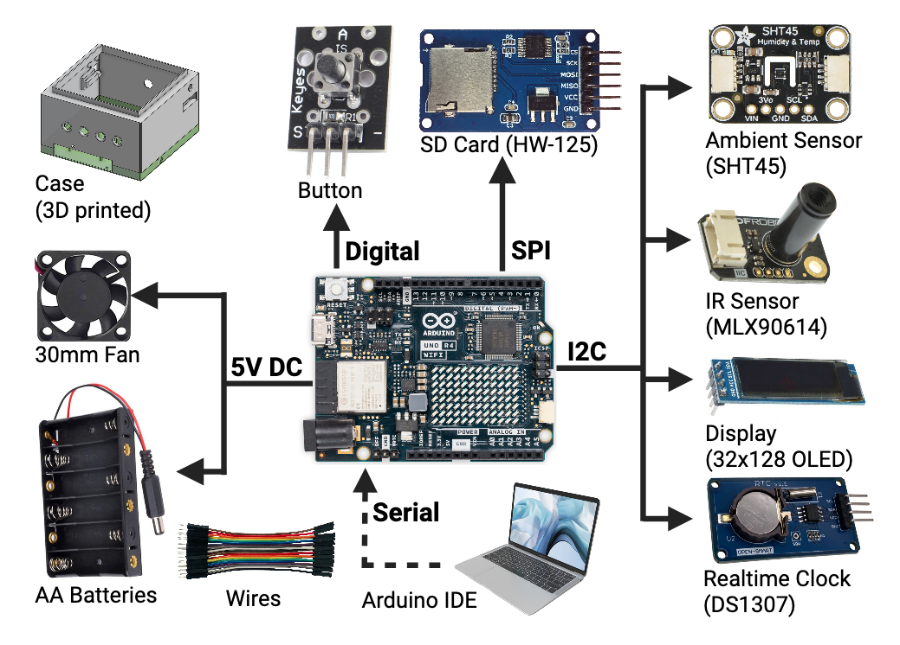

# Road Surface Temperature Device

Code for a small, portable road surface temperature device based on an Arduino and a variety of COTS electronic parts.

## Libraries

- [Adafruit SHT4x Library (Adafruit_SHT4x.h)](https://github.com/adafruit/Adafruit_SHT4x)
- [Adafruit GFX Library (Adafruit_GFX.h)](https://github.com/adafruit/Adafruit-GFX-Library)
- [SD (SD.h)](https://docs.arduino.cc/libraries/sd/)
- [DFRobot_MLX90614 (DFRobot_MLX90614.h)](https://github.com/DFRobot/DFRobot_MLX90614)
- [DS3231 (DS3231.h)](https://github.com/NorthernWidget/DS3231)
- [Adafruit SSD1306 (Adafruit_SSD1306.h)](https://github.com/adafruit/Adafruit_SSD1306)

## Wiring

